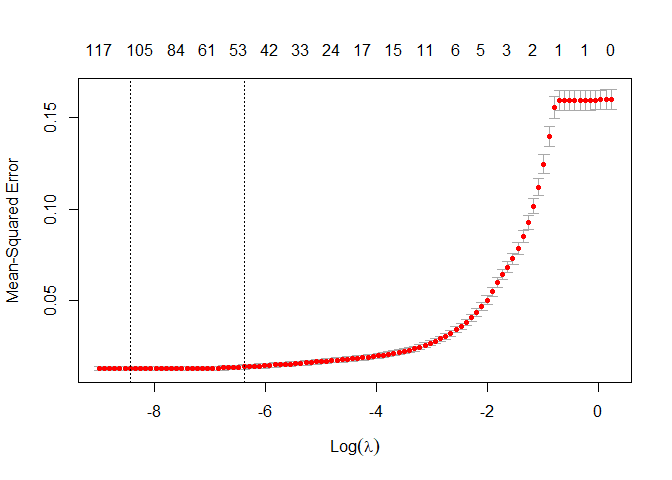

Abstract
========

The objective of this project is to predict house price given features in the dataset. To get a good understanding of the data set, Exploratory Data Analysis and data visualization are performed. Advanced linear regression is implemented to predict house price. Lasso regressions performs best with a cross validation RMSE-score of 0.1121 for log price, and it can also select important features from all 79 variables.

Introduction
============

### Objective

The goal of this project is to predict the price of each house given the features and interpret the model to find out what features may contribute to the value of a house.

### Data

The dataset contains 79 explanatory variables describing different aspects of residential homes in Ames, Iowa. The target variable is `SalePrice`, there’re 36 numerical variables and 42 categorical variables in the dataset.

Numerical variables include:
`GrLivArea`: Above ground living area square feet.
`GarageArea`: Size of garage in square feet.
`LotArea`: Lot size in square feet.
`MasVnrArea`: Masonry veneer area in square feet.
`PoolArea`: Pool area in square feet.

Categorical variables include:
`OverallQual`: Overall material and finish quality.
`OverallCond`: Overall condition rating.
`MSSubClass`: The building class.
`HouseStyle`: Style of dwelling.

Method
======
The correlation of variables and the target variable `SalePrice` are studied to select important features for regression.
Then, lasso regression and ridge regression are used to predict the house price as comparison to Ordinary Least Squares, we select the model that performs best on the test set.

Results
=======

### Data Visualization

###### Figure 1: The distribution of house price, which is right skewed.

###### Figure 2: The correlation plot of numerical variables which have correlation larger than 0.5 with `SalePrice`

It can be observed that the `Overall Quality` and `Above ground living area`
are two variables that have the highest correlation with `SalePrice`. The figure below show their strong correlaton with house price. Thus, these two variables are significant predictors. It can be observed that in the right plot above that index 524 and 1299 are outliers in the dataset (the two outliers have high Overall Quality at the same time).

###### Figure 3: `SalePrice` against Overall Quality and Above Ground Living Area.

As the distribution of `SalePrice` is right skewed(i.e. not normally distributed), we use the logarithm of `SalePrice` in our regression model.

###### Figure 4: The QQplot of logarithm of `SalePrice`, which is roughly normally distributed.

### Regression
The lasso regression have the best result over 1000 random train-test split(80% of the data are used as training set), compared to OLS and ridge regression.
Lasso regression has RMSE  of `0.111389` and selects 34 variables from the overall 79 variables. OLS and ridge regression have RMSE of `0.154890` and `0.122228` respectively.

The figure below shows that the regularization effect of lasso regression helps improve the regression result significantly.

###### Figure 5: MSE against the logarithm of the parameter of lasso regression

Conclusion
==========
For dataset with large number of correlated variables, data exploration through visualization could be useful for selecting variables that have strong correlation with target variable. Lasso regression can be an efficient method to select variables when explanatory variables are highly correlated.
