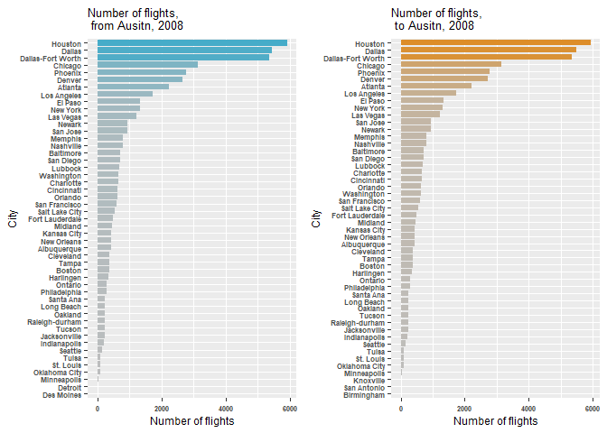
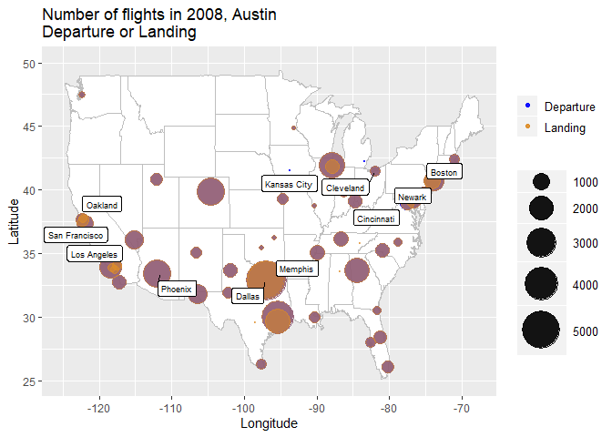
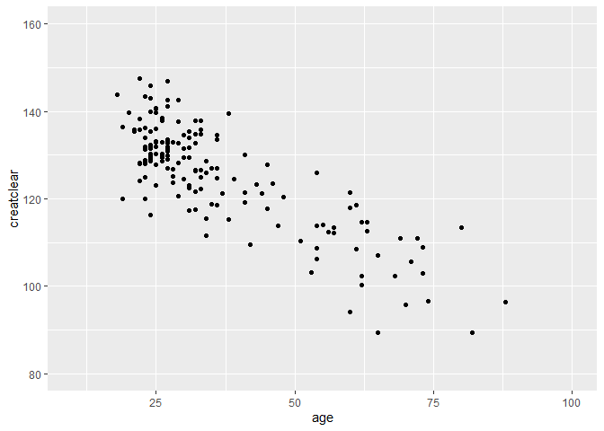
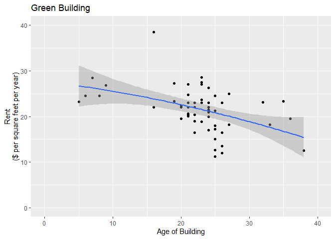
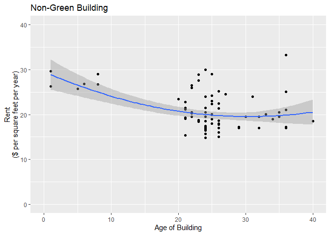
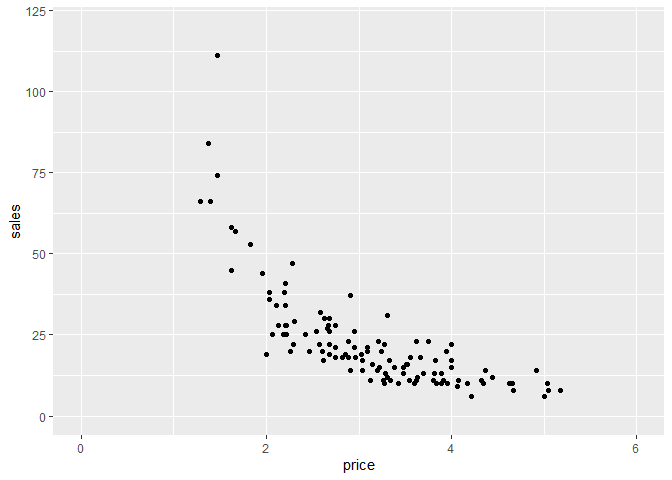
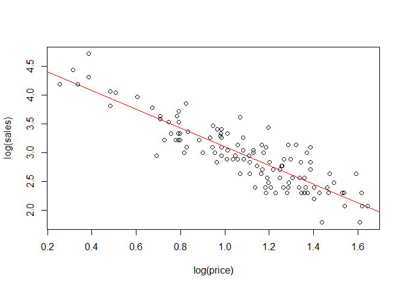
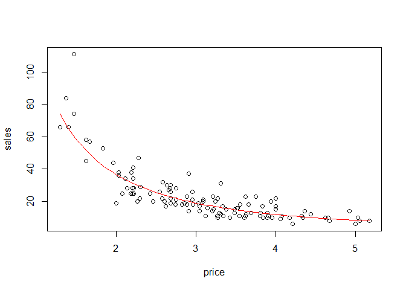
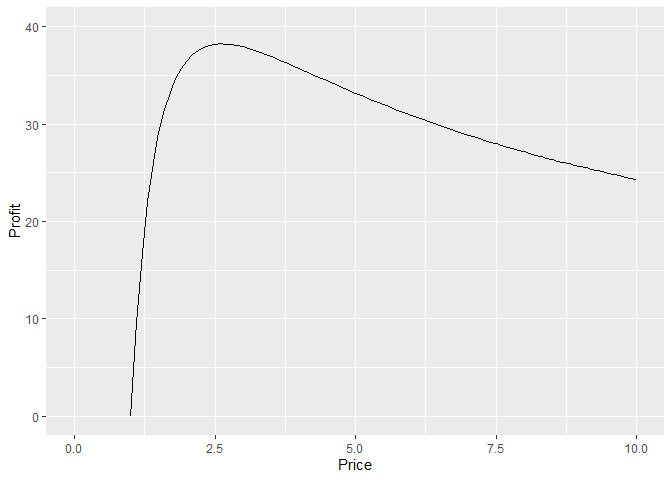

1.Data visualization: Flights at ABIA
-------------------------------------

### Data

Consider the data in [ABIA.csv](../data/ABIA.csv), which contains
information on every commercial flight in 2008 that either departed from
or landed at Austin-Bergstrom Interational Airport. The data in
[airports.txt](../data/airports.txt) contains the IATA code and
coordinates of every airport.

    ds_origin = subset(ds_flight, Origin=="AUS", select=c(Dest,Cancelled))
    ds_origin = subset(ds_origin, Cancelled==0, select=Dest)
    ds_dest = subset(ds_flight, Dest=="AUS", select=c(Origin,Cancelled))
    ds_dest = subset(ds_dest, Cancelled==0, select=Origin)

Create a dataset with airports information.

    ##               City IATAcode     lat      long
    ## 3201 Barter Island      BTI 70.1340 -143.5820
    ## 3202 Cape Lisburne      LUR 68.8751 -166.1100
    ## 3203     Point Lay      PIZ 69.7329 -163.0050
    ## 3204          Hilo      ITO 19.7214 -155.0480
    ## 3205       Orlando      ORL 28.5455  -81.3329
    ## 3206       Bettles      BTT 66.9139 -151.5290

#### The destination city frequency of flights that departed from Ausitn

    ##               City IATAcode     lat      long freq
    ## 3237        Boston      BOS 42.3643  -71.0052  365
    ## 3242       Oakland      OAK 37.7213 -122.2210  236
    ## 3247   Kansas City      MCI 39.2976  -94.7139  447
    ## 3251       Phoenix      PHX 33.4343 -112.0120 2768
    ## 3258 San Francisco      SFO 37.6190 -122.3750  605
    ## 3262       Memphis      MEM 35.0424  -89.9767  811

#### The origin city frequency of flights that landed at Ausitn

    ##               City IATAcode     lat      long freq
    ## 3237        Boston      BOS 42.3643  -71.0052  366
    ## 3242       Oakland      OAK 37.7213 -122.2210  236
    ## 3247   Kansas City      MCI 39.2976  -94.7139  447
    ## 3251       Phoenix      PHX 33.4343 -112.0120 2779
    ## 3258 San Francisco      SFO 37.6190 -122.3750  605
    ## 3262       Memphis      MEM 35.0424  -89.9767  816

### Data Visualization

#### Histogram

    ## # A tibble: 49 x 2
    ##    City              freq_city
    ##    <fct>                 <dbl>
    ##  1 Houston                5914
    ##  2 Dallas                 5449
    ##  3 Dallas-Fort Worth      5350
    ##  4 Chicago                3131
    ##  5 Phoenix                2768
    ##  6 Denver                 2659
    ##  7 Atlanta                2223
    ##  8 Los Angeles            1718
    ##  9 El Paso                1349
    ## 10 New York               1328
    ## # ... with 39 more rows

    ## # A tibble: 50 x 2
    ##    City              freq_city
    ##    <fct>                 <dbl>
    ##  1 Houston                5924
    ##  2 Dallas                 5468
    ##  3 Dallas-Fort Worth      5349
    ##  4 Chicago                3134
    ##  5 Phoenix                2779
    ##  6 Denver                 2712
    ##  7 Atlanta                2221
    ##  8 Los Angeles            1720
    ##  9 El Paso                1343
    ## 10 New York               1323
    ## # ... with 40 more rows

#### Flights information on US map

2.Regression
------------

### Data

The data in [creatinine.csv](../data/creatinine.csv) contains the age
and the creatclear of patients.

-   age: patient’s age in years.  
-   creatclear: patient’s creatine clearance rate in mL/minute, a
    measure of kidney health (higher is better).

##### Scatter plot of creatclear and age

### Linear regression

Fit a linear model for creatclear versus age. The coefficients are:

    lm1 = lm(creatclear~age, data=data1)
    coef(lm1)

    ## (Intercept)         age
    ## 147.8129158  -0.6198159

#### 1.The average creatinine clearance rate at age 55 is 113.7 mL/minute.

    new_data = data.frame(age=55)
    predict(lm1, new_data)

    ##       1
    ## 113.723

#### 2.The creatinine clearance rate of change with age is -0.62 mL/minute per year.

    ##        age
    ## -0.6198159

#### 3.Whose creatinine clearance rate is healthier for their age:

a 40-year-old with a rate of 135, or a 60-year-old with a rate of 112?

    predict1 = predict(lm1, data.frame(age=40))
    predict2 = predict(lm1, data.frame(age=60))
    resid_1 = 135-predict1
    resid_2 = 112-predict2
    resid_1

    ##        1
    ## 11.97972

    resid_2

    ##        1
    ## 1.376035

The difference between the first person and his expected creatinine
clearance rate: 11.98 mL/minute. The difference between the second
person and his expected creatinine clearance rate: 1.38 mL/minute. To
conclude: the first person’s creatinine clearance rate is healthier for
their age.

3.Green buildings
-----------------

### Data

The file [greenbuildings.csv](../data/greenbuildings.csv) contains data
on 7,894 commercial rental properties from across the United States. Of
these, 685 properties have been awarded either LEED or EnergyStar
certification as a green building.

Considering the developer plans to construct a new 15-story mixed-use
building on East Cesar Chavez, Austin, we need to filter the data fisrt.
From the dataset, we include buildings which are between 10 and 30
stories and employment growth rate that is below 60%, since the new
building is in downtown. Buildings with leasing rate below 20% are
excluded. Austin has a higher number of cooling degree days than heating
degree days according to the “2018 LOCAL CLIMATOLOGICAL DATA ANNUAL
SUMMARY WITH COMPARATIVE DATA”
report(<a href="https://cdn1.austinchamber.com/archive/files/ed/LCDAustinKAUS2018.pdf?mtime=20190718155709" class="uri">https://cdn1.austinchamber.com/archive/files/ed/LCDAustinKAUS2018.pdf?mtime=20190718155709</a>),
so we exclude data which has a higher heating degree days. For buildings
that net equals to 1, the total rent is recalculated with Electricity
costs and Gas costs.

    ##   CS_PropertyID cluster   size empl_gr leasing_rate stories age renovated
    ## 1        379105       1 260300    2.22        91.39      14  16         0
    ## 2        379839       1 164848    2.22        88.94      13  36         1
    ## 3        379285       1 174307    2.22        96.58      16   5         0
    ## 4         94765       1 231633    2.22        92.74      14  20         0
    ## 5        236739       6 210038    4.01        94.33      11  38         0
    ## 6        234578       6 225895    4.01        91.02      15  24         0
    ##   class_a class_b LEED Energystar green_rating cd_total_07 hd_total07
    ## 1       1       0    0          1            1        4988         58
    ## 2       0       1    0          0            0        4988         58
    ## 3       1       0    0          0            0        4988         58
    ## 4       1       0    0          0            0        4988         58
    ## 5       0       1    0          1            1        2746       1670
    ## 6       1       0    0          0            0        2746       1670
    ##   total_dd_07 Precipitation cluster_rent Rent_total
    ## 1        5046         42.57        36.78      38.56
    ## 2        5046         42.57        36.78      33.31
    ## 3        5046         42.57        36.78      40.69
    ## 4        5046         42.57        36.78      43.16
    ## 5        4416         25.55        17.50      12.50
    ## 6        4416         25.55        17.50      14.77

### Estimation

Thus, we can give a rough estimate that how long are we able to make
profits. The mean market rent of the buildings in cluster was $20.58 per
square foot per year, while the mean market rent in the green buildings
was $21.39 per square foot per year: about $0.81 more per square foot.
Because our building would be 250,000 square feet, this would translate
into an additional $250000 x 0.81 = $202500 of extra revenue per year if
we build the green building. Our expected baseline construction costs
are $100 million, with a 5% expected premium for green certification.
Thus we should expect to spend an extra $5 million on the green
building.Based on the extra revenue we would make, we would recuperate
these costs in $5000000/202500 = 24.7 years, which is much larger than
the previous 8 years estimation.

    ## [1] 24.7729

### The relationship between Rent and age

We can reveal that the rent decreases significantly as the age of the
building increases for green buildings. However, the effect is not that
significant for non-green buildings. The results are shown in the 2
figures below.

#### Green Building

#### Non-green Building

### Conclusion

This indicates that although we can cover the extra construction costs
in approximately 25 years on average, the profit will decrease in the
long run. While non-green building’s average rent is higher on the long
run, the profit of a green building is less than non-green building if
the developer plans to build a 15-story building on East Cesar Chavez,
Austin.

4.Milk prices
-------------

### Data

The data in [milk.csv](../data/milk.csv) contains a random sample of
daily sales figures for a small neighborhood grocery store of cartons of
milk.

-price: the price at which the milk was sold that day; -sales: how many
units were sold that day.

### Goal

Find the optimal milk price that maximize the profit. Suppose that the
per-unit cost is $1

##### Scatter plot of sales versus price

### Fit the demand curve

Q = K\*P^(E). P is the price and Q is sales. K and E are coefficients.

    # fitting curve: Q=K*P^(E)
    plot(log(sales)~log(price), data=ds_milk)
    lm1 = lm(log(sales)~log(price), data=ds_milk)
    abline(lm1, col="red")

    E = coef(lm1)[2]
    K = exp(coef(lm1)[1])

The coefficients of our linear model are:

    coef(lm1)

    ## (Intercept)  log(price)
    ##    4.720604   -1.618578

Thus, K and E are:

    ## (Intercept)
    ##     112.236

    ## log(price)
    ##  -1.618578

K = 112.236, E = -1.619

#### The demand curve

#### Profit function

profit = (P-c)\*K\*P^(E)

### The optimal price

Find the optimal price that maximzie profit.

    opt = optimize(f=fun_profit, interval=c(0,10), maximum=TRUE)
    P_opt = opt[1]
    max_profit = opt[2]
    P_opt

    ## $maximum
    ## [1] 2.616611

    max_profit

    ## $objective
    ## (Intercept)
    ##    38.24675

Conslusion: Under our regression model, the optimal milk price is $2.62
with the maximum profit $38.25 per day.
