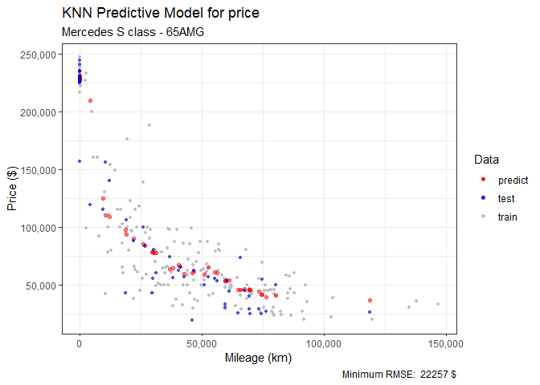
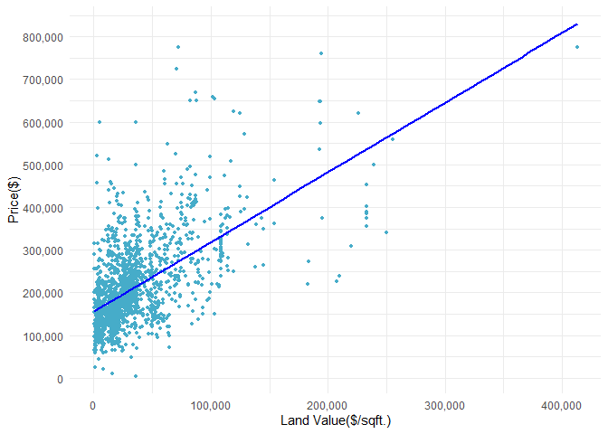

SDS323 Homework \#2
===================

1.KNN Regrssion for Car Price
-----------------------------

### Objective

The data in [sclass.csv](../data/sclass.csv) contains data on over 29,000 Mercedes S Class vehicles.  
We focus on three variables in particular:
- trim: categorical variable for car’s trim level, e.g. 350, 63 AMG, etc. The trim is like a sub-model designation.
- mileage: mileage on the car.
- price: the sales price in dollars of the car.

Our goal is to use K-nearest neighbors to build a predictive model for price, given mileage, separately for each of two trim levels: 350 and 65AMG.

### Data

#### *Trim: S Class 350*

###### Figure 1: Scatter plot of price against mileage for Mercedes S Class 350 vehicles

#### *Trim: S Class 65AMG*

###### Figure 2: Scatter plot of price against mileage for Mercedes S Class 65AMG vehicles

### Method

#### KNN Rrgression

We fit a KNN regression model to predict price given mileage. In KNN regression, the KNN algorithm is used for estimating continuous variables. The value is the average of the values of k nearest neighbors. Here, k is the hyperparameter in the KNN regression model.
Then, we find a heuristically optimal number k of nearest neighbors, based on RMSE (Root Mean Square Error), this is done using repitition of random train-test split.

### Result

#### *Trim: S Class 350*

We split the dataset into training and testing randomly(80% training data, 20% test data). Then, repeat the random train-test split for 1000 times for each value of k from 2 to 40 and find the optimal k with the minimum mean RMSE. The result of the optimal k is shown below.

###### Figure 3: RMSE against k. The optimal k is given by the vertical line.

The value of hyperparameter k in our fitted model:

    ## [1] 16

#### Fitted KNN Regression Model of S Class 350

###### Figure 4: Fitted KNN predictive model for price(S Class 350)

#### *Trim: S Class 65AMG*

We split the dataset into training and testing randomly(80% training data, 20% test data). Then, repeat the random train-test split for 1000 times for each value of k from 2 to 30 and find the optimal k with the minimum mean RMSE. The result of the optimal k is shown below.

###### Figure 5: RMSE against k. The optimal k is given by the vertical line.

The value of hyperparameter k in our fitted model:

    ## [1] 21

#### Fitted KNN Regression Model of S Class 65AMG

###### Figure 6: Fitted KNN predictive model for price(S Class 65AMG)

### Conclusion

The analysis above shows that trim of 65AMG yields a larger optimal value of k in KNN than trim of 350. From the scatter plots of price against mileage for S Class 350 and 65 AMG(Fig.1 and Fig.2), we can find out that the data points in the trim 350 can be separated into two clusters, while data points in the trim 65AMG is generally more evenly distributed. Also, the two clusters of data points in trim 350 have overlap on the horizontal(mileage) axis.
That is to say, a comparatively larger k for KNN regression are more likely to average more datapoints in the other cluster, which can lead to a larger RMSE.

2.Predicting House Price
------------------------

### Objective

The objective of the report is to present a price-modeling strategiy for taxing authority to predict house price in Saratoga, NY.

### Data

#### *Distribution of House Price*

#### *Variables*

We have 16 variable including the target variable `price`.

    colnames(SaratogaHouses)

    ##  [1] "price"           "lotSize"         "age"             "landValue"      
    ##  [5] "livingArea"      "pctCollege"      "bedrooms"        "fireplaces"     
    ##  [9] "bathrooms"       "rooms"           "heating"         "fuel"           
    ## [13] "sewer"           "waterfront"      "newConstruction" "centralAir"

#### *Correlation between Numerical Variables*

#### *Price vs. Living Area*

#### *Price vs. Land Value*

It can be shown that the `house price` has strong positive correlation with `Living Area` and `Land Value`. Some variables in the dataset like `rooms`, `bathrooms`, `bedrooms` have strong correlation.

### Method

#### Linear Regression

We fit a simple linear regression model as our baseline. To improve our linear model, some correlated variables are removed using our correlation matrix and interaction variables are selected using forward selection.

#### KNN Rrgression

KNN regression model is used to predict house price. We find a heuristically optimal number k of nearest neighbors, based on RMSE (Root Mean Square Error)
We compare different models using mean RMSE(Root Mean Square Error) over random train-test split.

### Result

#### *Approach 1: Linear Regression*

##### Baseline Linear Model

The baseline linear model `lm_medium` uses a medium size of variables in the dataset.

    lm_medium = lm(price ~ lotSize + age + livingArea + pctCollege + bedrooms + fireplaces + bathrooms + rooms + heating + fuel + centralAir, data=SaratogaHouses)

##### Forward selection

The forward selection consider all 3 way interaction between all variables. This approach can help us find the more important variables and interactions in our linear regression.

    lm0 = lm(price ~ 1, data=SaratogaHouses)
    lm_full = lm(price ~ (.)^2, data=SaratogaHouses)
    lm_forward = step(lm0, direction='forward', scope=formula(lm_full), trace=0)

The selected variables:

      [1] "livingArea"                       "landValue"                       
      [3] "bathrooms"                        "waterfrontNo"                    
      [5] "newConstructionNo"                "heatinghot water/steam"          
      [7] "heatingelectric"                  "lotSize"                         
      [9] "age"                              "centralAirNo"                    
     [11] "rooms"                            "bedrooms"                        
     [13] "landValue:newConstructionNo"      "bathrooms:heatinghot water/steam"
     [15] "bathrooms:heatingelectric"        "livingArea:bathrooms"            
     [17] "lotSize:age"                      "livingArea:waterfrontNo"         
     [19] "landValue:lotSize"                "livingArea:centralAirNo"         
     [21] "age:centralAirNo"                 "livingArea:landValue"            
     [23] "bathrooms:bedrooms"               "bathrooms:waterfrontNo"          
     [25] "heatinghot water/steam:bedrooms"  "heatingelectric:bedrooms"        
     [27] "heatinghot water/steam:rooms"     "heatingelectric:rooms"           
     [29] "waterfrontNo:centralAirNo"        "waterfrontNo:lotSize"            
     [31] "landValue:age"                    "age:rooms"                       
     [33] "livingArea:lotSize"               "lotSize:rooms"                   
     [35] "lotSize:centralAirNo"

##### Best Linear Model

Based on the medium model and forward selection model, we can find a linear model that performs best. We compare different models over 100 random train-test split.

       Model     RMSE_test
     lm_medium   66311.66
     lm_forward  62614.58
     lm_best     57541.85

The best linear model `lm_best`

    lm_best = lm(price ~ lotSize + age + landValue + livingArea + newConstruction + heating + waterfront +fuel*centralAir + bathrooms:livingArea + bedrooms:livingArea + livingArea:heating + landValue:newConstruction, data=saratoga_train)

The best linear model has mean RMSE:

     57541.85

#### *Approach 2: KNN Regression*

We split the dataset into training and testing randomly(80% training data, 20% test data). Then, repeat the random train-test split for 500 times for each value of k from 2 to 20 and find the optimal k with the minimum mean RMSE. The result of the optimal k is shown below.

###### figure: RMSE against k. The optimal k is given by the vertical line.

The value of hyperparameter k in our fitted model:

      11

#### Fitted KNN Regression Model for price

###### figure: Fitted KNN predictive model for price(S Class 350)

The minimum RMSE of KNN regression:

     61852.03

### Conclusion

From the result of linear regression and KNN regression, linear regression has a generally lower RMSE, which means that our best linear model has a better performance over KNN regression. In the house price prediction perspective, linear models may be the better solution. As we can see, we can consider interactions and categorical variables better in linear regression than KNN regression, the extra information of `new construction`, `heating`, etc. help us make better prediction.

3.Predicting When Articles Go Viral
-----------------------------------

*Regression and Classfication Approach*
---------------------------------------

### Objective

The data in [online\_news.csv](../data/online_news.csv) contains data on 39,797 online rticles published by Mashable during 2013 and 2014. The target variable is `shares`, i.e. how many times the article was shared on social media. The other variables are article-level features: things like how long the headline is, how long the article is, how positive or negative the “sentiment” of the article was, and so on. The full list of features is in [online\_news\_codes.txt](../data/online_news_codes.txt).

Mashable is interested in building a model for whether the article goes viral or not. They judge this on the basis of a cutoff of 1400 shares –that is, the article is judged to be “viral” if shares &gt; 1400. Mashable wants to know if there’s anything they can learn about how to improve an article’s chance of reaching this threshold.

We first approach this problem from the standpoint of regression. To assess the performance of your model on a test set, we *threshold* the model’s predictions: - if predicted shares exceeds 1400, predict the article as “viral” - if predicted shares are 1400 or lower, predict the article as “not viral”

As a second pass, we approach this problem from the standpoint of classification. That is, define a new variable `viral = ifelse(shares > 1400, 1, 0)` and build a model for directly predicting viral status as the target variable.

### Data

#### Variables

There are 37 variables in the dataset, including the target variable `shares`.

    ##  [1] "n_tokens_title"                "n_tokens_content"             
    ##  [3] "num_hrefs"                     "num_self_hrefs"               
    ##  [5] "num_imgs"                      "num_videos"                   
    ##  [7] "average_token_length"          "num_keywords"                 
    ##  [9] "data_channel_is_lifestyle"     "data_channel_is_entertainment"
    ## [11] "data_channel_is_bus"           "data_channel_is_socmed"       
    ## [13] "data_channel_is_tech"          "data_channel_is_world"        
    ## [15] "self_reference_min_shares"     "self_reference_max_shares"    
    ## [17] "self_reference_avg_shares"     "weekday_is_monday"            
    ## [19] "weekday_is_tuesday"            "weekday_is_wednesday"         
    ## [21] "weekday_is_thursday"           "weekday_is_friday"            
    ## [23] "weekday_is_saturday"           "weekday_is_sunday"            
    ## [25] "is_weekend"                    "global_rate_positive_words"   
    ## [27] "global_rate_negative_words"    "avg_positive_polarity"        
    ## [29] "min_positive_polarity"         "max_positive_polarity"        
    ## [31] "avg_negative_polarity"         "min_negative_polarity"        
    ## [33] "max_negative_polarity"         "title_subjectivity"           
    ## [35] "title_sentiment_polarity"      "abs_title_sentiment_polarity"
    ## [37] "shares"

#### Distribution of Shares

#### Correlation between Variables

###### Figure 1: The coorelation matrix of selected variables.

It can be observed that the *title subjectivity* and *absolute title polarity* are positively correlated, *number of words in the content* and *number of links* and *number of images* are also correlated positively. Also, *average length of the words in the content* is correlated with *average polarity of positive words* and *average polarity of negative words*.

### Method

#### Regression Approach: Linear Regression

We fit a simple linear regression model with all the given variables to predict shares as our baseline. To improve our linear model, some correlated variables are removed using our correlation matrix, and lasso regression is also imlplemented.

#### Classfication Approach: Logistic Regression

Logistic regression model is fitted to predict whether the shares are greater than 1400. Step forward feature selection is implemented to find the best model.

We compare different models using mean RMSE(Root Mean Square Error) over 100 random train-test split. Confusion matrix is used to evaluate the performance of fitted models.

### Result

#### *Approach 1: Regression*

The baseline linear model `lm_full` uses all variables in the dataset.

    lm_full = lm(shares~(.), data=D_train)

We can notice that `max_negative_polarity`, `min_negative_polarity`, `avg_negative_polarity` and `max_positive_polarity`, `min_positive_polarity`, `avg_positive_polarity` and `self_reference_max_shares`, `self_reference_min_shares`, `self_reference_avg_shares` are correlated, so we only keep `avg_negative_polarity`, `avg_positive_polarity` and `self_reference_avg_shares` in our model `lm_1`.

    lm_1 = lm(shares~(.-max_negative_polarity-max_positive_polarity-self_reference_max_shares-self_reference_min_shares-is_weekend-min_positive_polarity-min_negative_polarity), data=D_train)

##### Lasso Regressions

We remove the same correlated variables mentioned above and then apply the lasso regression.

    lm_lasso = glmnet(X_train, y_train, alpha=1, standardize=FALSE)

Comparison of the mean RMSE in the test set over 100 random train-test split:

       Model  RMSE_test
    simple lm  11514.04
         lm_1  11510.27
        lasso  11527.25

#### Confusion Matrix

We choose `lm_1` as our fitted model, since it has the best out-of-sample perfomance.

The confusion matrix over 100 random train-test split:

    ##    yhat
    ## y         0       1
    ##   0   79.51 3939.43
    ##   1   29.85 3880.21

Average overall error rate:

     0.5006029

Average true positive rate:

     0.9923658

Average false positive rate:

     0.9802162

The null model (predict all news go viral) Average overall error rate:

   0.5065584

Average true positive rate: 1
Average false positive rate: 1

Our best linear regression model only does slightly better than the *null* model and the false positive rate is unreasonably high.

#### *Approach 2: Classification*

#### Logistic Regression

The fitted lasso regression.

    logit_best = glm(viral~(. - self_reference_min_shares - self_reference_max_shares - is_weekend - min_positive_polarity - max_positive_polarity - min_negative_polarity - max_negative_polarity)^2, data=X_train, family='binomial')

#### Confusion Matrix

The confusion matrix over 100 random train-test split:

    ##    yhat
    ## y         0       1
    ##   0 3518.31  495.29
    ##   1 2549.46 1365.94

Average overall error rate:

     0.3840018

Average true positive rate:

     0.3488635

Average false positive rate:

     0.1234029

The null model (predict all news go viral) Average overall error rate:

     0.5065584

Average true positive rate: 1
Average false positive rate: 1

### Conclusion

Our best logistic regression model has a lower overall error(&lt; 40%) rate than the null model and our linear regression model in classification. The linear model has a rather high true positive and false positive rate. This means that our linear model performs poorly when the news does not go viral. The logistic regrssion model has a much lower false positive rate than linear model, but performs worse than linear model when the news actually goes viral.

Lasso regression can select variables important to our target value `shares`.
By observing the coefficients of lasso regression, we find out that *Avg. shares of referenced articles in Mashable*, *Number of link*, *Number of keywords in the metadat* have strong positive impact on `shares`, while *Number of words in the content* and *Average length of the words in the content* have negative impact on `shares`.
