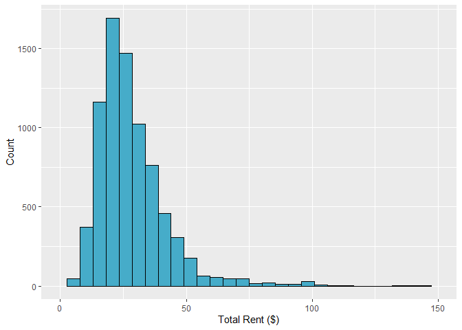
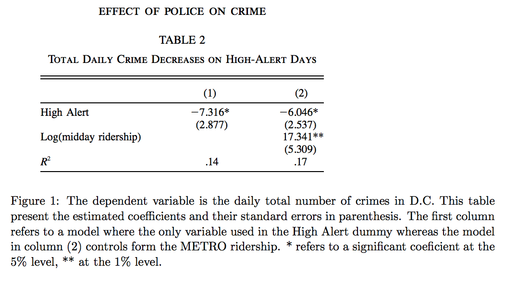

# SDS 323 Statistical Learning
## Exercise #3

1.Predicting Building Rent
------------------------

### Objective

The objective of the report is to build the predictive model for house rent, in dollars per square foot per calendar year and evalate the average change in rental income associated with green certification.

### Data

#### Variables

We have 25 variable including the target variable `Rent`.

    colnames(df)

    ##  [1] "CS_PropertyID"     "cluster"           "size"             
    ##  [4] "empl_gr"           "Rent"              "leasing_rate"     
    ##  [7] "stories"           "age"               "renovated"        
    ## [10] "class_a"           "class_b"           "LEED"             
    ## [13] "Energystar"        "green_rating"      "net"              
    ## [16] "amenities"         "cd_total_07"       "hd_total07"       
    ## [19] "total_dd_07"       "Precipitation"     "Gas_Costs"        
    ## [22] "Electricity_Costs" "cluster_rent"      "Rent_total"       
    ## [25] "class"

#### Data Preprocessing

#### *Distribution of Rent*

#### *Rent vs. Cluster Rent*

#### *Rent over Green Certificate*

###### Figure above shows that only Energy star green certificate improves total rent significantly. Non-green building, LEED and EnergyStar are 0, 1 and 2 in the figure above.

#### *Rent vs. Class*

###### class\_c, class\_b, class\_a are 0, 1 and 2 respectivley in the figure above.

### Method

Given that we have data of cluster rent(average rent in the building’s local market) for each building and it is shown above that the rent has a rough positive linear relatioship with cluster rent, so we try to predict the Z-score of each building in its own cluster.
The Z-score can evaluate the difference between rent and cluster rent, which is a more precise approach to evaluate the rent given cluster rent.

We also define a new variable
`number of cooling degree days in the building's region`/`number of heating degree days in the building's region`,
which can improve the results significantly.

#### Linear Regression

We fit a simple linear regression model as our baseline. To improve our linear model, we implement lasso regression to select features.

We compare different models using mean RMSE(Root Mean Square Error) over random train-test split.

### Result

##### Baseline Linear Model

    lm_1 = lm(rent_Z ~ (.-total_dd_07-green_rating), data=ds)

##### Lasso Regression

    lasso = cv.glmnet(X, y, nfolds=10, alpha=1, standardize=FALSE)

All numerical varibales are normalized in data preprocessing and indicator are remained the same.

##### Fitted Linear Model

Based on the medium model and lasso model, we select variables with non-zero coefficients  
We compare different models over 100 random train-test split.

    ## [1] 9.354848

    ## [1] 9.275341

The simple linear regression and lasso regression with all 2 way interaction have RMSE of 9.35 and 9.23 respectively.

To evaluate the impact of green certificate on rent, we add the variable LEED and Energystar to the lasso linear model as our fitted model.

The fitted linear model:

    lm = lm(rent_Z ~ (LEED + Energystar + size + cd_total_07 + hd_total07 + class + size:ch + empl_gr:class + leasing_rate:class + age:class + amenities:class), data=ds)

The fitted linear model has mean RMSE:

    ## [1] 9.229832

The coefficients of the 2 green building certificates:

    ##      LEED
    ## 0.2947558

    ## Energystar
    ##  0.2086808

As we can see, buildings with LEED and EnergyStar green certificate can improve 0.29 and 0.21 standard deviation of rent in their own clusters respectively.

## 2. What causes what?

First, listen to [this podcast from Planet Money.](https://www.npr.org/sections/money/2013/04/23/178635250/episode-453-what-causes-what)  Then use your knowledge of statistical learning to answer the following questions.

1. Why can’t I just get data from a few different cities and run the regression of “Crime” on “Police” to understand how more cops in the streets affect crime? (“Crime” refers to some measure of crime rate and “Police” measures the number of cops in a city.)  

    Statistically, we can only find correlation between crime and police through observational data and correlation does not imply causation.We can't tell it's more police that cause decrease in crime or more crime leads to more police.

2. How were the researchers from UPenn able to isolate this effect? Briefly describe their approach and discuss their result in the “Table 2” below, from the researchers' paper.  

    

     The researchers analyze the data of police and crime when there're more police in the city, but unrelated to street crime.
     The statistic in the table shows that on the occasion when police increased, the Metro ridership does not decrease, which means that the decrease of crime is not caused by the decrease of number of possible victims.

3. Why did they have to control for Metro ridership? What was that trying to capture?   

     The Metro ridership is used to evaluate the number of possible victims. If the Metro ridership goes down, the decrease in street crime may well caused by the decrease in people on the street.

4. Below I am showing you "Table 4" from the researchers' paper.  Just focus on the first column of the table. Can you describe the model being estimated here?
What is the conclusion?

  

   The model is trying to estimate the reduction of crime in District 1 compared to other districts.

3.Clustering and PCA
--------------------

### Data

#### Variables

We have 13 variable including the target variable `quality` and `color`.

    ##  [1] "fixed.acidity"        "volatile.acidity"     "citric.acid"         
    ##  [4] "residual.sugar"       "chlorides"            "free.sulfur.dioxide"
    ##  [7] "total.sulfur.dioxide" "density"              "pH"                  
    ## [10] "sulphates"            "alcohol"              "quality"             
    ## [13] "color"

### Method

PCA and clustering algorithm are both implemented on the 11 chemical properties of wine to help distinguish red wines from white wines.

### Result

#### Clustering

We use CH index to evaluate the optimal k for our kmeans clustering.

We choose k = 3 as our fitted clustering model.

    clust = kmeanspp(X, 3, nstart=100)

Plot the result of our clustering on color and quality.

It can be observed that almost all the datapoints of cluster1 in the figure above falls in the red wine area. Clustering using k=3 seems to be a good predictor for classifying red wine and white wine. Also, this unsupervised learning technique is unbale to sort the higher from the lower quality wines.

    ##         pred_white
    ## color     0     1
    ##   red    57    4841
    ## white   1891   3007

    ## [1] 0.981376

The accuracy of classifying red and white wine is over 98%.

#### PCA

The results of PCA of 11 chemicals:

    ## Importance of components:
    ##                           PC1    PC2    PC3     PC4     PC5     PC6     PC7
    ## Standard deviation     1.7407 1.5792 1.2475 0.98517 0.84845 0.77930 0.72330
    ## Proportion of Variance 0.2754 0.2267 0.1415 0.08823 0.06544 0.05521 0.04756
    ## Cumulative Proportion  0.2754 0.5021 0.6436 0.73187 0.79732 0.85253 0.90009
    ##                            PC8     PC9   PC10    PC11
    ## Standard deviation     0.70817 0.58054 0.4772 0.18119
    ## Proportion of Variance 0.04559 0.03064 0.0207 0.00298
    ## Cumulative Proportion  0.94568 0.97632 0.9970 1.00000

We can use the logistic regression to classfiy red wine and white wine, which also gives a accuracy of over 98%.
    ## logit = glmnet(X, y, family='binomial')

    ## [1] 0.9861475

The result of PCA can only shows the principal compinents of the wine, which describes the main ingresdients of the wine. This unsupervised learning ia not able to sort the higher from the lower quality wines.

4.Market Segmentation
---------------------

### Correlation Analysis

The correlation plot above reveals that there are strong correlations between groups of variables in the dataset.

#### Results

`online gaming`, `college_uni` and `sports playing` are variables have stronng positive correlation with each other. Obviously, this group of potential customers are college students who enjoy gaming and sports, also we can assume taht the majority of the group are male.

`outdoors`, `health_nutrition` and `personal_fitness` are variables also share strong positive correlation. This group of customers have a healthy life style and care about their personal fitness, so they should be the main target of *NutrientH20*.

`cooking`, `beauty` and `fashion` is another group of variables share positive correlation. The majority of this group is likely to be potential young female customers. However, the plot below shows that `fashion` and `health_nutrition` have a negative relatioship.
Apparently, This group care less about healthy life style according to their social media, this could be a maerket segmentation that has huge potential.

